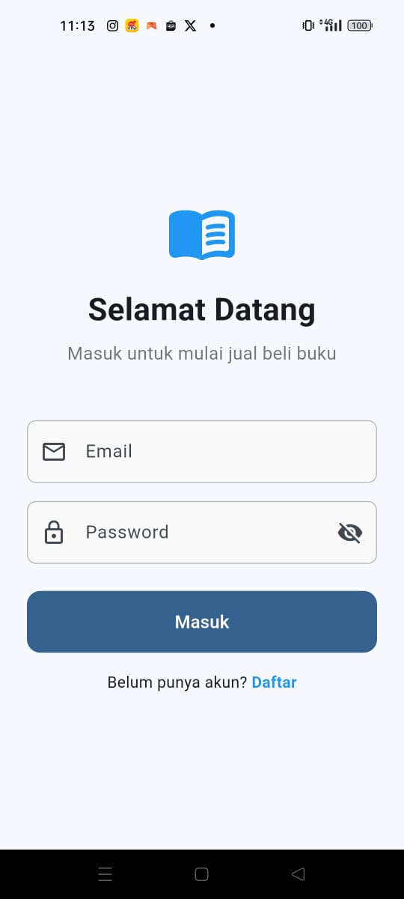
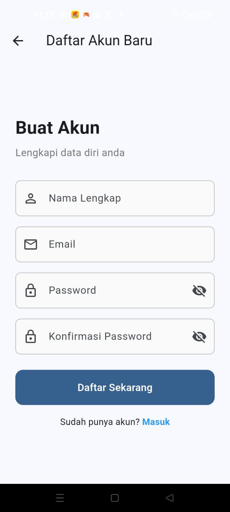
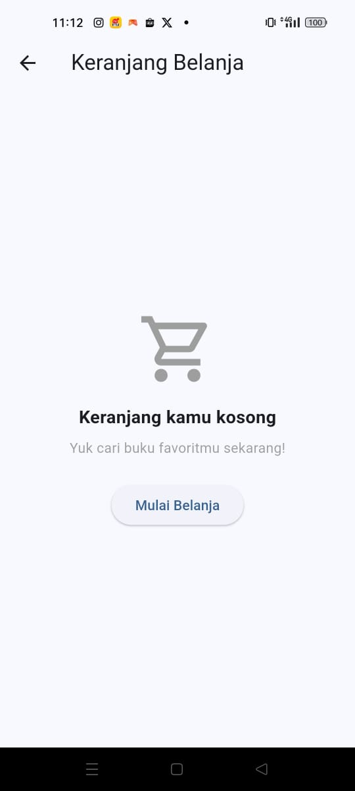
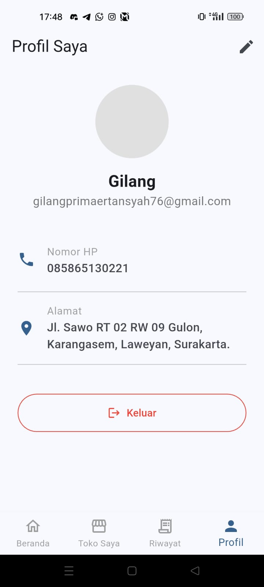
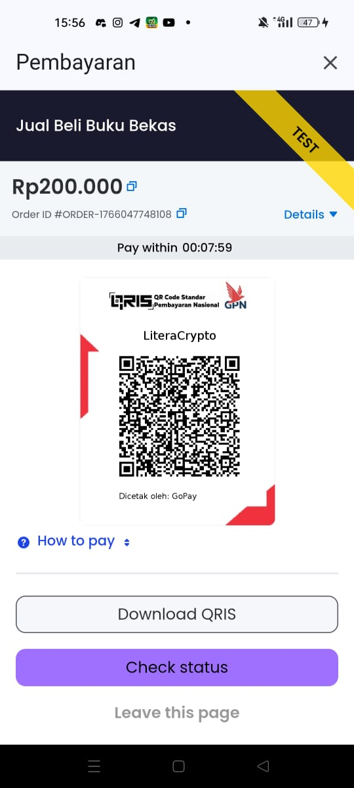

# Ujian Akhir Semester Pemrograman Mobile: Jual Beli Buku Bekas

**Kelas**: TI22C1

**Kelompok**: 1  

**Anggota Kelompok**:  
1. Puspita Auliana Putri  
2. Gilang Prima Ertansyah (NIM: 220103092)  
3. Ifah Istiqomah  
4. Danang Saputra  

Kami dari Kelompok 1 memilih tema aplikasi Jual Beli Buku Bekas untuk proyek ini. Aplikasi ini dirancang dengan berbagai fitur yang komprehensif mulai dari autentikasi pengguna, manajemen produk (buku), fitur keranjang belanja, hingga fitur chat real-time antara penjual dan pembeli.

## Arsitektur & Teknologi

Aplikasi ini dibangun menggunakan pendekatan pengembangan aplikasi modern (*Modern App Development*) dengan mengintegrasikan berbagai layanan handal:

- **Flutter**: Digunakan sebagai framework utama untuk pengembangan antarmuka aplikasi (*frontend*) yang responsif dan berjalan lancar pada perangkat mobile.
- **Supabase**: Digunakan sebagai *Backend-as-a-Service* (BaaS). Supabase menangani manajemen Database (PostgreSQL) untuk menyimpan data pengguna dan transaksi, serta fitur Autentikasi dan *Storage* untuk penyimpanan gambar/cover buku.
- **Midtrans**: Diintegrasikan sebagai *Payment Gateway* untuk menangani sistem pembayaran secara aman dan otomatis, memudahkan pengguna dalam menyelesaikan transaksi pembelian.

Pengembangan aplikasi ini dilakukan dengan perhatian khusus pada kemudahan penggunaan dan antarmuka yang modern. Setiap fitur dirancang agar intuitif, memastikan pengguna dapat menavigasi aplikasi dengan mudah. Dokumentasi ini menyajikan penjelasan rinci mengenai setiap fitur yang ada dalam aplikasi, dilengkapi dengan tangkapan layar terbaru.

Berikut adalah laporan hasil coding dan dokumentasi fitur aplikasi:

## 1. Halaman Login

Halaman login memiliki tampilan yang bersih dengan sapaan "Selamat Datang". Pengguna diminta memasukkan kredensial untuk masuk ke sistem.
- **Header**: Logo aplikasi dan teks sapaan.
- **Form**: Input field untuk Email dan Password (dengan fitur *toggle visibility*).
- **Navigasi**: Tombol "Masuk" dan link untuk mendaftar jika belum memiliki akun.

## 2. Halaman Registrasi

Halaman ini digunakan untuk pendaftaran pengguna baru. Data pengguna akan disimpan secara aman di database Supabase.
- **Header**: "Buat Akun" dengan sub-header instruksi.
- **Form**:
  - Nama Lengkap
  - Email
  - Password
  - Konfirmasi Password
- **Action**: Tombol "Daftar Sekarang" untuk menyimpan data ke database.

## 3. Halaman Beranda (Homepage)

Halaman utama aplikasi yang muncul setelah login. Halaman ini menjadi pusat navigasi bagi pengguna.
- **Banner**: Promosi visual "Buku Bekas, Ilmu Berkualitas".
- **Header Action**: Ikon Chat dan Keranjang Belanja di pojok kanan atas.
- **List Buku**: Menampilkan daftar buku "Terbaru Hari Ini" yang diambil dari database secara *real-time*.
- **Floating Action Button**: Tombol "+ Jual Buku" untuk akses cepat menjual produk.
- **Bottom Navigation Bar**: Navigasi ke Beranda, Pesan, Toko Saya, Riwayat, Keranjang, dan Profil.

## 4. Halaman Jual Buku (Tambah Produk)

Fitur bagi pengguna untuk mengunggah buku yang ingin dijual. Gambar yang diunggah akan disimpan di Supabase Storage.
- **Media**: Area untuk upload foto sampul buku.
- **Form Input**:
  - Judul Buku
  - Harga (Rp)
  - Stok
  - Kategori (Dropdown: misal Novel)
  - Kondisi (Dropdown: misal Bekas)
  - Deskripsi Buku

## 5. Halaman Produk Saya

Halaman manajemen untuk melihat daftar buku yang sedang dijual oleh pengguna.
- **List Item**: Menampilkan thumbnail, judul, stok, dan harga.
- **Actions**: Ikon pensil untuk mengedit detail buku dan ikon tempat sampah untuk menghapus buku dari daftar jual.

## 6. Halaman Keranjang Belanja

Halaman ini menampung buku yang akan dibeli pengguna. Tangkapan layar menunjukkan "Empty State" ketika keranjang kosong.
- **Visual**: Ikon keranjang dan teks informasi "Keranjang kamu kosong".
- **Action**: Tombol "Mulai Belanja" untuk mengarahkan pengguna kembali mencari buku.

## 7. Fitur Chat (Daftar Pesan)

Halaman yang memuat riwayat percakapan pengguna dengan pengguna lain. Fitur ini memanfaatkan kemampuan *real-time* dari Supabase.
- **List Item**: Menampilkan avatar pengguna, nama lawan bicara, *preview* pesan terakhir, dan waktu pengiriman pesan.

## 8. Fitur Chat (Ruang Percakapan)

Detail percakapan antar pengguna untuk negosiasi atau tanya jawab seputar buku.
- **Header**: Nama lawan bicara.
- **Bubble Chat**: Membedakan pesan masuk (kiri, abu-abu) dan pesan keluar (kanan, biru).
- **Input**: Kolom "Tulis pesan..." dan tombol kirim.

## 9. Halaman Profil Pengguna

Menampilkan informasi detail akun pengguna yang sedang login.
- **Info Utama**: Foto profil, Nama, dan Email.
- **Detail**: Nomor HP dan Alamat Lengkap.
- **Edit**: Ikon pensil di pojok kanan atas untuk masuk ke mode edit.
- **Logout**: Tombol "Keluar" untuk mengakhiri sesi.

## 10. Halaman Edit Profil

Formulir untuk memperbarui data diri pengguna.
- **Avatar**: Opsi untuk mengganti foto profil.
- **Form Edit**:
  - Nama Lengkap
  - Nomor HP
  - Alamat Lengkap
- **Action**: Tombol "Simpan Perubahan" untuk mengupdate data.

## 11. Halaman Pembayaran (Payment Gateway)

Setelah melakukan checkout, pengguna akan diarahkan ke halaman pembayaran yang terintegrasi dengan **Midtrans**. Halaman ini mendukung berbagai metode pembayaran, salah satunya QRIS.
- **Informasi Transaksi**: Menampilkan total nominal yang harus dibayar dan ID Order.
- **QRIS Code**: Kode QR dinamis yang dapat di-scan/diunduh untuk melakukan pembayaran melalui e-wallet (GoPay, OVO, dll) atau Mobile Banking.
- **Status Cek**: Tombol untuk memeriksa status pembayaran secara manual.

## 12. Riwayat Pembelian (Pembeli)

Tab "Pembelian Saya" menampilkan daftar pesanan yang telah dilakukan. Status transaksi akan diperbarui otomatis setelah pembayaran via Midtrans berhasil.
- **Info Pesanan**: Menampilkan ID Order, item yang dibeli, dan total harga.
- **Status**: Indikator status pesanan (misalnya "Selesai") dan informasi apakah pesanan sudah diulas.

## 13. Manajemen Pesanan Masuk (Penjual)

Tab "Pesanan Masuk" ditujukan bagi pengguna saat bertindak sebagai penjual untuk mengelola pesanan.
- **List Order**: Daftar pesanan yang perlu diproses.
- **Kontrol Status**: Tombol interaktif untuk memperbarui status pesanan secara bertahap:
  - **Dikemas**: Menandai barang sedang disiapkan.
  - **Dikirim**: Menandai barang sudah dalam pengiriman.
  - **Selesai**: Menandai transaksi telah rampung.
