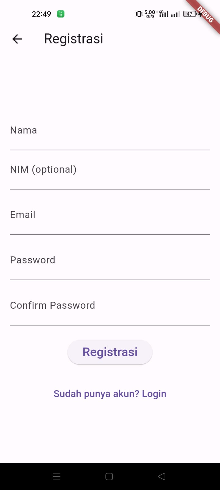
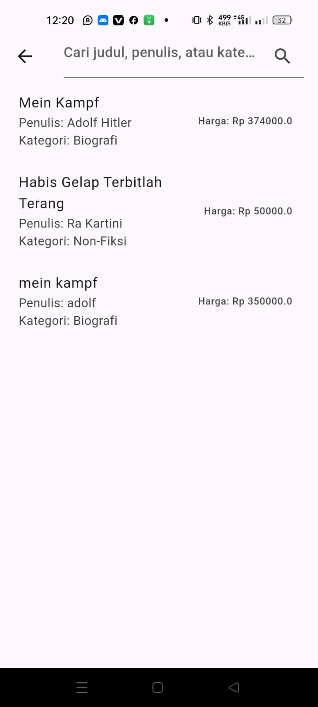

# Ujian Akhir Semester Pemrograman Mobile: Jual Beli Buku Bekas

**Nama**: Gilang Prima Ertansyah  
**Kelas**: 22TIA3  
**NIM**: 220103092  

Saya memilih tema aplikasi Jual Beli Buku Bekas untuk proyek ini dengan bekerja sendiri tanpa anggota kelompok lainnya. Aplikasi ini dirancang dengan berbagai fitur yang komprehensif antara lain pendaftaran pengguna baru dan login bagi pengguna yang sudah terdaftar fitur untuk menambahkan buku yang ingin dijual oleh pengguna serta kemampuan untuk mencari buku berdasarkan judul atau nama penulis. Selain itu aplikasi ini juga mendukung proses checkout untuk pembelian buku dan pembuatan invoice yang detail untuk transaksi yang dilakukan.

Pengembangan aplikasi ini dilakukan secara mandiri dengan perhatian khusus pada kemudahan penggunaan dan antarmuka yang ramah pengguna. Setiap fitur dirancang agar intuitif dan mudah diakses memastikan pengguna dapat dengan mudah menavigasi dan menggunakan aplikasi tanpa kesulitan. Dokumentasi ini menyajikan penjelasan rinci mengenai setiap fitur yang ada dalam aplikasi dilengkapi dengan tangkapan layar untuk memberikan gambaran yang jelas mengenai fungsi dan tampilan setiap bagian dari aplikasi. Berikut adalah laporan hasil coding yang mencakup penjelasan fitur-fitur utama yang ada dalam aplikasi ini:

## Screenshot 1

Pada halaman login aplikasi ini menampilkan header dengan teks "Login" di bagian atas. Terdapat tombol "Kembali" di sudut kiri atas yang mengarahkan pengguna kembali ke halaman sebelumnya. Bagian utama halaman login berisi form untuk masuk ke dalam aplikasi yang mencakup input field "NIM or Email" untuk pengguna memasukkan nomor identifikasi mahasiswa atau alamat email mereka serta input field "Password" untuk memasukkan kata sandi. Setelah mengisi form ini pengguna dapat menekan tombol "Login" untuk masuk ke dalam aplikasi. Selain itu di bagian bawah form terdapat tombol "Belum punya akun? Registrasi" yang mengarahkan pengguna ke halaman registrasi jika mereka belum memiliki akun. Berikut fiturnya secara poin:
- Header: "Login"
- Button: "Kembali"
- Text: "Login"
- Body berisi login form:
  - Input field for "NIM or Email"
  - Input field for "Password"
  - Button: "Login" untuk masuk
  - Button: "Belum punya akun? Registrasi" untuk route ke register form

## Screenshot 2

Halaman registrasi ditandai dengan header "Registrasi" di bagian atas dan tombol "Kembali" yang berada di sudut kiri atas untuk kembali ke halaman login. Di bagian utama halaman ini terdapat form registrasi yang terdiri dari beberapa input field yaitu "NIM (optional)" untuk memasukkan nomor identifikasi mahasiswa (opsional), "Nama" untuk memasukkan nama pengguna, "Email" untuk alamat email pengguna, "Password" untuk membuat kata sandi, dan "Confirm Password" untuk mengkonfirmasi kata sandi yang dimasukkan. Setelah mengisi form ini pengguna dapat menekan tombol "Registrasi" untuk membuat akun baru. Di bagian bawah form terdapat tombol "Sudah memiliki akun? Login" yang membawa pengguna kembali ke halaman login jika mereka sudah memiliki akun. Berikut fiturnya secara poin:
- Header: "Registrasi"
- Button: "Kembali"
- Text: "Register"
- Body berisi registrasi form:
  - Input field for "NIM (optional)"
  - Input field for "Nama"
  - Input field for "Email"
  - Input field for "Password"
  - Input field for "Confirm Password"
  - Button: "Registrasi" untuk registrasi akun
  - Button: "Sudah memiliki akun? Login" kembali ke login form

## Screenshot 3

Pada halaman menu utama aplikasi header berjudul "Menu" dengan teks "Toko Buku" di bagian utama. Halaman ini juga dilengkapi dengan menu popup yang menyediakan dua opsi: "Tambah Buku" yang memungkinkan pengguna menambahkan buku yang ingin mereka jual dan "Keluar" yang mengarahkan pengguna keluar dari aplikasi ke halaman pertama. Bagian utama halaman menampilkan daftar buku bekas yang tersedia, yang masing-masing buku ditampilkan dengan detail lengkap termasuk judul, gambar cover, kategori, penulis, harga, jumlah halaman, jumlah buku yang tersedia, dan status ketersediaannya. Berikut fiturnya secara poin:
- Header: "Menu"
- Text: "Toko Buku"
- Menu Popup:
  - "Tambah Buku" untuk menambah buku pengguna yang ingin dijual
  - "Keluar" untuk keluar dari page ke halaman pertama
- Body:
  - List buku bekas yang tersedia berserta judul, cover, kategori, penulis, harga, jumlah halaman, jumlah buku, dan statusnya

## Screenshot 4

Halaman untuk menambah buku baru memiliki header "Kembali" di bagian atas yang memungkinkan pengguna kembali ke halaman sebelumnya. Di bagian utama halaman ini terdapat form untuk menambahkan buku baru dengan beberapa input field: "Judul Buku" untuk memasukkan judul buku, "URL Cover Buku" untuk URL gambar cover buku, "Jumlah Halaman" untuk jumlah halaman buku, dan "Tahun Penggunaan" untuk tahun penggunaan buku. Setelah mengisi semua informasi yang diperlukan pengguna dapat menekan tombol "Tambah Buku" untuk menambahkan buku yang ingin mereka jual ke dalam daftar buku yang tersedia di aplikasi. Berikut fiturnya secara poin:
- Header: "Kembali"
- Form untuk tambah buku:
  - Input field for "Judul Buku"
  - Input field for "URL Cover Buku"
  - Input field for "Jumlah Halaman"
  - Input field for "Tahun Penggunaan"
  - Button: "Tambah Buku" untuk tambah buku yang pengguna ingin jual

## Screenshot 5

Pada fitur pencarian buku terdapat komponen "Search Component" yang memungkinkan pengguna mencari buku berdasarkan judul atau penulis. Bagian utama halaman ini menampilkan daftar buku yang tersedia sesuai dengan kriteria pencarian yang dimasukkan oleh pengguna. Komponen pencarian ini memudahkan pengguna menemukan buku yang mereka cari dengan lebih cepat dan efisien. Berikut fiturnya secara poin:
- Component: "Search Component" untuk search buku dari judul ataupun author dan lain-lain
- Terdapat list buku yang tersedia.

## Screenshot 6

Halaman checkout aplikasi ini menampilkan header "Checkout" di bagian atas dan tombol "Back" yang memungkinkan pengguna kembali ke halaman sebelumnya. Di bagian utama halaman checkout terdapat form untuk mengisi informasi pembelian yang mencakup beberapa teks informasi seperti harga dan stok buku. Form ini juga memiliki input field untuk jumlah buku yang ingin dibeli, nama pembeli dan alamat pengiriman. Pengguna dapat memilih opsi pengiriman melalui COD atau bank BNI jika memilih opsi pengiriman. Setelah mengisi semua informasi yang diperlukan pengguna dapat menekan tombol "Checkout" yang akan memunculkan popup invoice seperti yang ditampilkan pada screenshot berikutnya. Berikut fiturnya secara poin:
- Header: "Checkout"
- Button: "Back"
- Body:
  - Form untuk checkout barang:
    - Text: Checkout
    - Text: Harga stok
    - Input field for Jumlah, nama pembeli, dan alamat
    - Option untuk COD dan bank BNI jika pilih dikirim.
    - Options untuk dikirim atau pengambilan buku
    - Button: "Checkout" (popup invoice setelah button di checkout. Popup ada di screenshot 8)

## Screenshot 7

Popup invoice yang muncul setelah proses checkout berisi peringatan untuk screenshot invoice dan mengirimkannya ke email penjual. Bagian utama popup ini menampilkan informasi detail seperti invoice yang mencantumkan rincian pembelian termasuk buku yang dibeli, harga buku, jumlah buku, dan opsi pengiriman yang dipilih. Popup ini memberikan informasi yang jelas dan lengkap kepada pengguna mengenai transaksi yang telah mereka lakukan serta instruksi untuk menyelesaikan proses pembayaran dan pengiriman. Berikut fiturnya secara poin:
- Popup: Invoice
- Warning: Harap screenshot invoice dan screenshot dikirim ke email penjual
- Body:
  - Text: Invoice
  - Text: Buku
  - Text: Harga Buku
  - Text: Jumlah Buku
  - Text: Opsi Pengiriman yang Dipilih

## Link Proyek
- [YouTube](https://www.youtube.com/watch?v=lUIlfoa9RR0)
