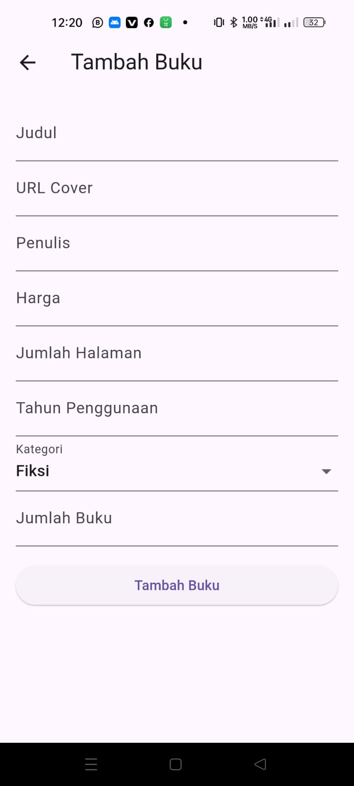

# jualbeli_buku_bekas

## Screenshot 1

- Header: "Bookstore"
- Button: "Login"

## Screenshot 2

- Header: "Login"
- Button: "Kembali"
- Text: "Login"
- Body:
  - Input field for "NIM or Email"
  - Input field for "Password"
  - Button: "Login"
  - Button: "Belum punya akun? Registrasi"

## Screenshot 3

- Header: "Registrasi"
- Button: "Kembali"
- Text: "Register"
- Body:
  - Input field for "Nama"
  - Input field for "NIM (optional)"
  - Input field for "Email"
  - Input field for "Password"
  - Input field for "Confirm Password"
  - Button: "Registrasi"
  - Button: "Sudah memiliki akun? Login"

## Screenshot 4

- Header: "Menu"
- Text: "Toko Buku"
- Menu Popup:
  - "Tambah Buku"
  - "Keluar"
- Body:
  - List of books with clickable items

## Screenshot 5

- Header: "Kembali"
- Form:
  - Input field for "Judul Buku"
  - Input field for "URL Cover Buku"
  - Input field for "Jumlah Halaman"
  - Input field for "Tahun Penggunaan"
  - Button: "Tambah Buku"

## Screenshot 6

- Component: "Search Component"

## Screenshot 7

- Header: "Checkout"
- Button: "Back"
- Body:
  - Form for checkout:
    - Text: "Checkout"
    - Text: "Harga"
    - Input field for "Jumlah"
    - Options for shipping
    - Button: "Checkout" (to open the popup)

## Screenshot 8

- Popup: "Invoice"
- Warning: "Harap screenshot invoice"
- Body:
  - Text: "Invoice"
  - Text: "Buku:"
  - Text: "Harga Buku"
  - Text: "Jumlah Buku"
  - Text: "Opsi Pengiriman yang Dipilih"

## Getting Started

This project is a starting point for a Flutter application.

A few resources to get you started if this is your first Flutter project:

- [Lab: Write your first Flutter app](https://docs.flutter.dev/get-started/codelab)
- [Cookbook: Useful Flutter samples](https://docs.flutter.dev/cookbook)

For help getting started with Flutter development, view the
[online documentation](https://docs.flutter.dev/), which offers tutorials,
samples, guidance on mobile development, and a full API reference.
# jualbeli_bukubekas
